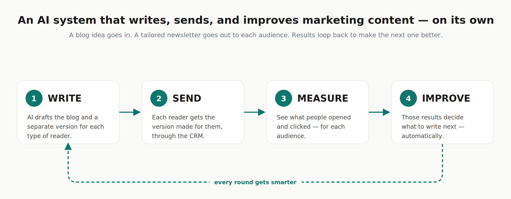

# AI PMM Workflows

**Product-marketing judgment, turned into systems that run.** A series of AI-powered workflows
by **I-Wen (Elaine) Lee** — each one takes a piece of PMM thinking (who to target, what to say,
what to do next) and turns it into a repeatable, runnable workflow. The throughline: *the
judgment drives the automation, not the other way around.*

### 👉 [**View the case study**](https://liwelaine.github.io/ai-pmm-workflows/) &nbsp;·&nbsp; a walkthrough with diagrams and real output



---

## What's inside

Each workflow is a self-contained folder that works **two ways** — as a **Claude skill**
(`SKILL.md`, invoked in chat) and as a **runnable program** (`python main.py`), sharing the
same code.

| Workflow | What it does | Status |
|---|---|---|
| [**ai-content-pipeline**](./ai-content-pipeline) | Give it a company or an ICP → it proposes buyer personas (*you confirm them*) → generates a blog + a newsletter tailored to each persona → simulates engagement → recommends what to publish next. Demonstrated on Zip & Shopify. | ✅ Live |

*New workflows are added here only once they run end-to-end and produce real output.*

## The idea in one line

A blog and three newsletters from one topic isn't the interesting part — **the segmentation is.**
A CFO and a first-time founder need different messages, so the workflow makes the audience model
explicit and puts a human checkpoint on it: **AI proposes the personas, the PMM confirms, then the
system executes.** That checkpoint is the whole point.

## Run it (no API keys needed)

```bash
cd ai-content-pipeline
pip install -r requirements.txt
python main.py run --company zip          # built-in example
python main.py run --profile examples/shopify.json   # or any company profile
```

Each run writes a self-contained `report.html` (generate → distribute → measure → optimize).
See [`ai-content-pipeline/`](./ai-content-pipeline) for the skill workflow and full docs.

---

<sub>Independent portfolio project. Company names and any company figures are used illustratively
and belong to their owners; all engagement metrics shown are simulated for demonstration.</sub>
