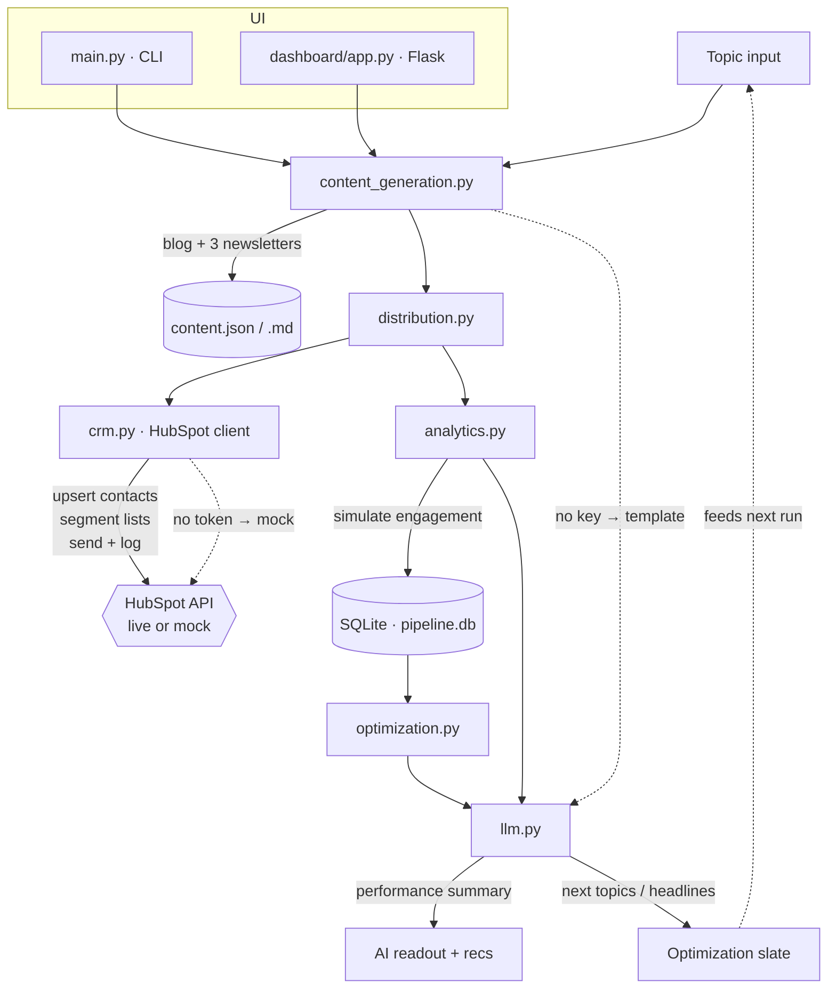

# AI Content Pipeline

> **Two ways to use this.** As a **Claude skill** — see [`SKILL.md`](./SKILL.md): give Claude a
> company or an ICP, confirm the personas it proposes, and it generates the content + report.
> As a **runnable program** — `python main.py run --company zip` (below), no API keys needed.
> Both share the same `pipeline/` code.

A lightweight, mostly hands-free pipeline that **generates** marketing content with an
LLM, **distributes** it to segmented audiences through a CRM (HubSpot), and **measures
and optimizes** it based on engagement — closing the loop from a blog idea to a
performance-driven recommendation for the next one.

> Built for the *Content & Growth Analyst* take-home, then generalized into a
> **company-profile-driven** engine and demonstrated on two real, very different companies:
> **Zip** (enterprise procurement) and **Shopify** (SMB commerce).

**The whole thing runs with zero API keys** (every external dependency mocks cleanly),
so a reviewer can clone and run it in one command. Add keys in `.env` to flip individual
subsystems to live.

---

## What it does

```
                 ┌──────────────┐
   topic ───────▶│  1. GENERATE │  Claude → 1 blog (400–600w) + 3 persona newsletters
                 └──────┬───────┘  stored as JSON + Markdown
                        │
                        ▼
                 ┌──────────────┐
                 │ 2. DISTRIBUTE│  HubSpot → upsert + tag contacts, segment lists,
                 └──────┬───────┘  send per-persona variant, log campaign
                        │
                        ▼
                 ┌──────────────┐
                 │ 3. MEASURE   │  simulate opens/clicks/unsubs → SQLite (history)
                 └──────┬───────┘  → AI performance summary + recommendations
                        │
                        ▼
                 ┌──────────────┐
                 │ 4. OPTIMIZE  │  read engagement trends → next topics + headline A/Bs
                 └──────────────┘  (feeds back into stage 1)
```

### Architecture & flow



The CLI (`main.py`) and the Flask dashboard (`dashboard/app.py`) are both thin
orchestrators over the same `pipeline/` modules — no logic is duplicated.

---

## Repo structure

```
ai-content-pipeline/
├── main.py            # CLI entry point: run / history / optimize
├── config.py          # env loading + live-vs-mock detection
├── requirements.txt
├── .env.example       # all configuration documented here
├── smoke_test.py      # dashboard test (Flask test client)
│
├── pipeline/          # shared core — one module per stage
│   ├── llm.py                 # Claude wrapper + deterministic mock fallback
│   ├── personas.py            # audience segments + engagement priors
│   ├── content_generation.py  # stage 1 · blog + per-persona newsletters
│   ├── crm.py                 # stage 2 · HubSpot client (live/mock)
│   ├── distribution.py        # stage 2 · segment + send orchestration
│   ├── analytics.py           # stage 3 · simulate, persist, summarize
│   ├── optimization.py        # stage 4 · next-content recommendations
│   └── storage.py             # SQLite schema + historical queries
│
├── data/              # generated at runtime, gitignored
│   ├── contacts.json          # mock contact book, segmented by persona
│   ├── pipeline.db            # campaign + metric history
│   └── runs/                  # per-run content + reports
│
└── dashboard/         # Flask front-end over the same pipeline/
    ├── app.py
    └── templates/index.html
```

---

## Company profiles & personas (the segmentation decision)

The pipeline is **company-profile driven**: the same engine runs for any company by
swapping one profile (context + seed content + audience personas) in
`pipeline/personas.py`. Two profiles ship as examples, and they deliberately segment
*differently* — which is the whole point:

| Company | What it sells | Segments by | The three audiences |
|---|---|---|---|
| **Zip** | Enterprise procurement software | **organizational role** (an enterprise has many distinct stakeholders) | Procurement Leader · Finance Leader · Business Requester |
| **Shopify** | Commerce platform for SMB owners | **business stage** (one owner wears every hat, so maturity matters more than title) | First-time Founder · Growing DTC Brand · Established Retailer |

The segmentation *logic* adapts to the market, not just the persona names. Each persona
carries its content angle and a newsletter template, plus engagement priors used by the
simulation layer. Adding a company or changing the segmentation is a one-file edit.

---

## Tools, APIs & models

| Concern | Choice | Notes |
|---|---|---|
| Content + summaries | **Anthropic Claude** (`claude-sonnet-4`) | via the official `anthropic` SDK; swappable behind `pipeline/llm.py` |
| CRM / distribution | **HubSpot** v3 CRM + Marketing APIs | real endpoints & payloads built for every call (see below) |
| Storage / history | **SQLite** (stdlib) | accumulates campaigns + metrics across runs for comparison |
| Content storage | **JSON + Markdown** | `data/runs/<campaign>/content.{json,md}` |
| Dashboard | **Flask** + Jinja2 | single-page control room; reuses the pipeline modules |
| CLI tables | **tabulate** | terminal performance report |

### HubSpot endpoints exercised (`pipeline/crm.py`)

| Action | Method & endpoint |
|---|---|
| Upsert + tag contact | `POST /crm/v3/objects/contacts` (custom `persona` property) |
| Define persona segment | `POST /crm/v3/lists` (dynamic list filtered on `persona`) |
| Send newsletter variant | `POST /marketing/v3/transactional/single-email/send` |
| Log campaign | `POST /crm/v3/objects/marketing_campaigns` |

In mock mode the client **builds the exact request (endpoint + JSON payload) and records
it** to `data/runs/<campaign>/crm_requests.json` instead of sending, so you can inspect
realistic payloads without an account.

---

## Assumptions & what's mocked

- **No keys required.** With `ANTHROPIC_API_KEY` unset, `llm.py` uses a deterministic
  template engine that still produces topic-aware blog + newsletter copy, an AI-style
  performance summary, and optimization suggestions — so the full loop is demonstrable
  offline. The prompts sent to the real model are the same ones the mock routes on.
- **HubSpot runs in mock mode by default** (`HUBSPOT_MODE=mock`). Requests are built and
  logged, not sent. Set `HUBSPOT_MODE=live` + a token to actually call the API.
- **Engagement is simulated, not real.** Each persona has a baseline open/click/unsub
  rate (a realistic prior) plus run-to-run noise (`SIM_SEED` for reproducibility).
- **Sample vs. segment.** The CRM stage sends to a small *sample* of real contacts in
  `contacts.json` to demonstrate the API mechanics, while engagement is simulated over a
  larger notional *segment audience* (set per persona) so reported rates are smooth and
  comparable — the way a real ESP reports them. Both numbers are shown.
- **Segmentation** is modeled via a custom `persona` contact property + a dynamic list,
  rather than HubSpot's UI-built lists.

---

## Run it locally

Requires Python 3.10+.

```bash
# 1. install
python -m venv .venv && source .venv/bin/activate
pip install -r requirements.txt

# 2. (optional) configure live keys — skip this to run fully mocked
cp .env.example .env        # then fill in ANTHROPIC_API_KEY / HubSpot token

# 3. run the full pipeline (pick a company profile)
python main.py run --company zip
python main.py run --company shopify
python main.py run --profile examples/zip.json   # or any custom profile JSON
#   (optional) override the seed topic:  --topic "Your topic here"

# 4. inspect accumulated history & lifetime averages
python main.py history

# 5. ask for next-content ideas from history alone
python main.py optimize
```

### Dashboard (bonus)

```bash
python dashboard/app.py        # then open http://127.0.0.1:5000
```

Enter a topic, hit **Run pipeline**, and watch content, segment performance, the AI
summary, and the optimization slate populate. (Best viewed in a modern browser.)

### Going live

| Set in `.env` | Effect |
|---|---|
| `ANTHROPIC_API_KEY=sk-ant-...` | content + summaries generated by Claude |
| `HUBSPOT_ACCESS_TOKEN=...` + `HUBSPOT_MODE=live` | requests actually sent to HubSpot |
| `SIM_SEED=` (blank) | fresh randomized engagement each run |

Startup prints a banner, e.g. `LLM=LIVE (Claude) | CRM=mock | sim_seed=42`, so you
always know which subsystems are live.

---

## Design notes

- **Provider-agnostic LLM seam.** Everything goes through `LLM.complete()` /
  `complete_json()`. Swapping Claude for OpenAI/Gemini is one file.
- **Same code, two front-ends.** CLI and dashboard share the pipeline; nothing is
  reimplemented for the UI.
- **History is first-class.** Metrics persist to SQLite keyed by `(campaign, persona)`,
  enabling the lifetime averages and trend-aware optimization the brief asks for.
- **Graceful degradation over hard failure.** A missing key or a malformed model
  response degrades to a sensible default rather than crashing the run.

## If I had more time

- Real A/B send-time testing with a HubSpot workflow + winner promotion.
- A proper scheduler (cron / GitHub Action) for the "weekly" cadence.
- Statistical significance checks before acting on a persona's rate delta.
- Pull *real* opens/clicks back from HubSpot's analytics API to replace the simulator.
